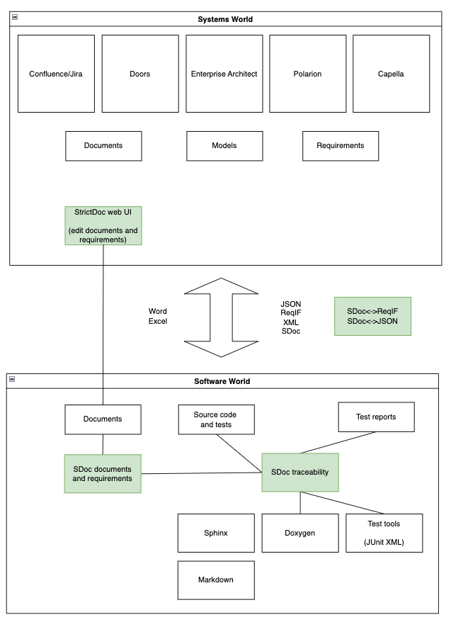

# 2025-03-18 StrictDoc Office Hours #1

## Participants

- Stanislav P.
- Maryna B. (StrictDoc developers)
- Tobias D. ([Linutronix](https://www.linutronix.de/), security certification, CRA)
- Johan E. (functional safety HW/SW)
- Roberto B. (University of Parma, courses of safety-critical software, co-founder of [BUGSENG](https://www.bugseng.com/), ECLAIR SW verification platform)
- Nicole P. (safety, Safety Manager for Zephyr RTOS, head of SPDX safety)
- Richard B.
- Hannah C. ([gaitQ](https://www.gaitq.com/), medical device manufacturer)
- Mischa J. (embedded HW/SW development, a few medical customers)

## Backlog discussion / collect user feedback

[StrictDoc workspace (Roadmap, Backlog, etc)](https://drive.google.com/file/d/1pkI0T1eAbcTSyCnqH4wCKKQSOfgWTaxi/view?usp=sharing) A simplified StrictDoc applications diagram:  

## Optional: JUnit XML report information for StrictDoc's own documentation

Requirements verification is WIP: 
