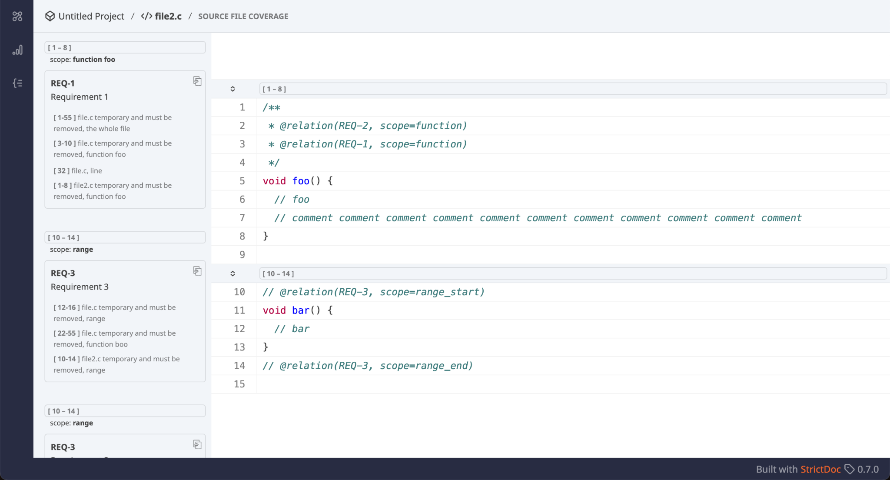
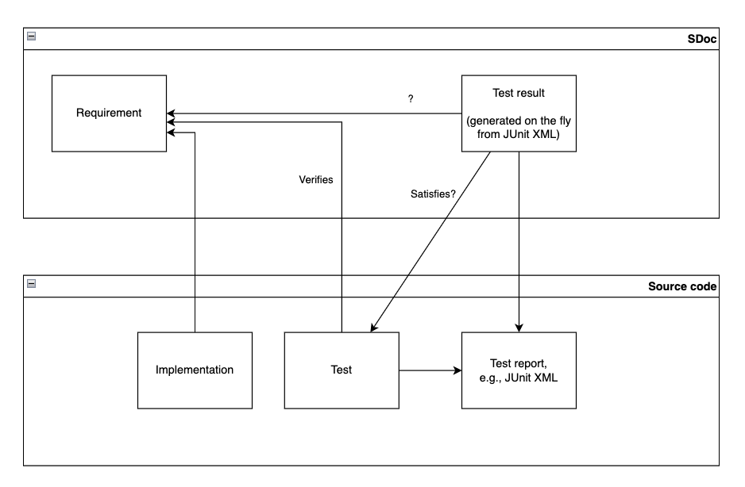

# 2025-03-27 StrictDoc Office Hours #2

## Participants

- Stanislav P.
- Tobias D.
- Richard B.
- Hannah C.

## StrictDoc Validation

Evidence is required to demonstrate that the product's (e.g., StrictDoc tool)
intended use has been established and verified. StrictDoc shall demonstrate
traceability between requirements and tests. Medical: ISO 13485 quite short, not
overly prescriptive, manufacturer chooses the approach and tools. Consequence:
There is no standard for what a requirements tool should do. Richard/Hanna:
Possible milestone: ISO 13485 certification by the end of 2025. StrictDoc's
existing arguments for quality: Pretty high code coverage from multiple levels
of testing (unit, integration, end2end). Static typing for all Python code to
prevent regressions because the StrictDoc codebase is non-trivial. Documentation
content and structure inspired by the European space standards (ECSS). Developed
with safety in mind which is an argument of its own that could be expanded.
Richard and Hanna could review the
[L1 document of StrictDoc](https://strictdoc.readthedocs.io/en/stable/stable/docs/strictdoc_20_L1_Open_Requirements_Tool.html)
and the
[DO-178C](https://strictdoc.readthedocs.io/en/stable/stable/docs_extra/DO178_requirements.html)
and
[Zephyr](https://strictdoc.readthedocs.io/en/stable/stable/docs_extra/Zephyr_requirements.html)
technical notes and understand the deltas between what's already there and what
is needed for the medical device certification.

## Source View screen rework

Some demo screens demonstration… The source view screen is about 50% complete
(see attached). I can present what has been done so far and explain why: We are
mainly improving the visual identification of traceability for: whole files,
classes (available in Python but not in C), functions, code ranges, and
individual lines. We are also adding full but collapsible requirements cells
above the relevant functions, ranges, etc, so that they stay above the
implementation. Closely related to this work is the recent addition of File
Relation Roles by Tobias:
[#2104](https://github.com/strictdoc-project/strictdoc/pull/2104). Feedback is
appreciated. Richard: Generating project statistics and other important screens
to PDF could become important when the project documentation release is made.

## Optional: JUnit XML report information for StrictDoc's own documentation

Requirements verification is WIP: 
