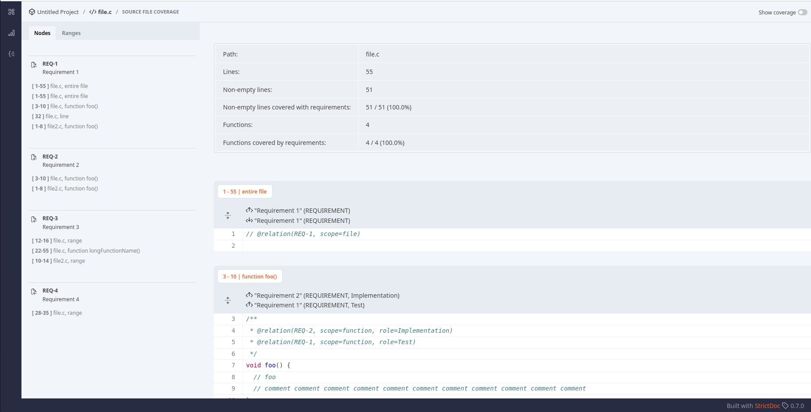

# 2025-04-10 StrictDoc Office Hours #4

## Participants

- Stanislav P.
- Tobias D.
- Thomas S.

## Source View screen rework

## Missing test coverage justification

Demo for generating Gcov information to SDoc.

## Topic 1

Make the query language more versatile. Maybe a bit like GraphQL? Or XPath? For example, instead of adding `node.has_relation_with_role("TEST")` we could also add `count(node.relations[type="FILE][role="TEST"]) > 0` (the expression type of node.relations would be a node-set, `type="FILE"` would be a predicate). But how to get there? Add some more expressions now and then as the need occurs, or design the query language top down with a proper specification?

## Topic 2

[DOCUMENT] TITLE: Hello world doc [REQUIREMENT] UID: REQ-1 VERSION: 2 STATEMENT: Test statement. [REQUIREMENT] UID: REQ-2 STATEMENT: Test statement. RELATIONS: - TYPE: Parent   VALUE: REQ-1   VERSION: 1 and also the source code markers are versioned: /*   * @relation(REQ-1, scope=function, version=3)  */

## Optional: JUnit XML report information for StrictDoc's own documentation

Requirements verification is WIP. Roughly two types of projects: Those that maintain separate Test specifications that are linked to test cases in code. Those that only keep test cases in code. Both project types can be modelled with StrictDoc. Creating a test specification is possible with a custom grammar, and the creation of test case specs is done by a user. StrictDoc links test results to test cases in source code automatically. If a user also links test case specs in documents to test cases specs in code, StrictDoc will handle that traceability as well. An open point: Merging correctly Google Test pattern-generated functions on the left panel of the Source View Screen. An edge case that has to be handled. Related SPDX modelling work can be seen here: [https://app.diagrams.net/#G1nQ0NoRkeYSD8DfN0Cc7krxVkianBfpaX#%7B%22pageId%22%3A%22hfANuODBiJIAxb1JN4Ct%22%7D](https://app.diagrams.net/#G1nQ0NoRkeYSD8DfN0Cc7krxVkianBfpaX#%7B%22pageId%22%3A%22hfANuODBiJIAxb1JN4Ct%22%7D). 

## The upcoming feature for adding external URLs to requirements and other nodes – see #1495

Use case example: Functional safety. Preliminary Hazard Analysis of a system. Can be a plain Word document (text, diagrams), finding the main hazards in the system. Two options: Convert the document to SDoc Provide an external link to the document.  In any case, the external link feature is a must and will be implemented.
