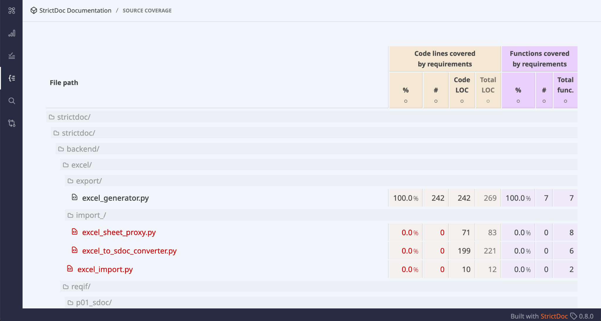
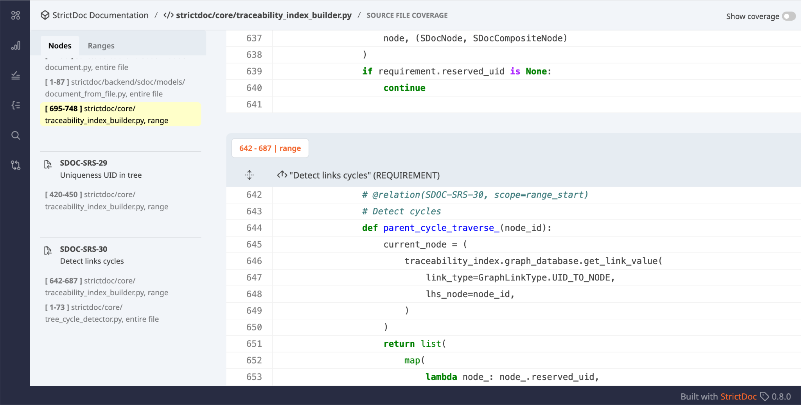

# 2025-04-15 StrictDoc Office Hours #5

## Participants

- Stanislav P.
- Roberto B.
- Nicole P.
- Richard B.
- Hannah C.

## Backlog discussion / collect user feedback

Any open topics from anyone?

## Source View screen rework

We have released https://github.com/strictdoc-project/strictdoc/releases/tag/0.8.0. Check out the release notes. I could show a demo of the new Source View and Source Coverage screens and explain the reasoning behind the new UI/UX.    ** Roberto**: Language-aware parsing? **Stanislav**: Yes, since 2024-Q4, StrictDoc uses tree-sitter to parse C/C++/Python code into AST. Mainly used to recognize functions. Macros work to some extent, for example, the Google Test macros are recognized but for complex macros that act like functions, the function markers can most probably not be used. Other languages such as Rust, are planned. **Roberto**: Is the source file marker parser customizable? **Stanislav**: Currently it is fixed to a syntax @relation(...) or @relation{...} but the parser is encapsulated in a class, so it should be possible to customize it if someone would strongly request this.

## StrictDoc's qualification data package

Check out the new issue with an outline of how StrictDoc's own qualification data package could be built: Feature: Automatic generation of StrictDoc's qualification data package, https://github.com/strictdoc-project/strictdoc/issues/2147. It could be discussed whether the approach makes sense and if something is missing. **Roberto**: Does this include Validation in a sense of Functional Safety? **Stanislav**: StrictDoc's test coverage is ensured by Integration Tests which are essentially end-to-end tests of the command-line interface (350+ itests) and the end2end tests of the web interface (\~250 tests). Needs to be clarified from is assumed by Functional Safety but in terms of the e2e test coverage StrictDoc should be in a good position. **Nicole**: The list is missing a Safety Manual.

## Optional: JUnit XML report information for StrictDoc's own documentation

Requirements verification is WIP. Roughly two types of projects: Those that maintain separate Test specifications that are linked to test cases in code. Those that only keep test cases in code. Both project types can be modelled with StrictDoc. Creating a test specification is possible with a custom grammar, and the creation of test case specs is done by a user. StrictDoc links test results to test cases in source code automatically. If a user also links test case specs in documents to test cases specs in code, StrictDoc will handle that traceability as well. Related SPDX modelling work can be seen here: [https://app.diagrams.net/#G1nQ0NoRkeYSD8DfN0Cc7krxVkianBfpaX#%7B%22pageId%22%3A%22hfANuODBiJIAxb1JN4Ct%22%7D](https://app.diagrams.net/#G1nQ0NoRkeYSD8DfN0Cc7krxVkianBfpaX#%7B%22pageId%22%3A%22hfANuODBiJIAxb1JN4Ct%22%7D). 

## The upcoming feature for adding external URLs to requirements and other nodes – see #1495

Use case example: Functional safety. Preliminary Hazard Analysis of a system. Can be a plain Word document (text, diagrams), finding the main hazards in the system. Two options: Convert the document to SDoc Provide an external link to the document.  In any case, the external link feature is a must and will be implemented.
