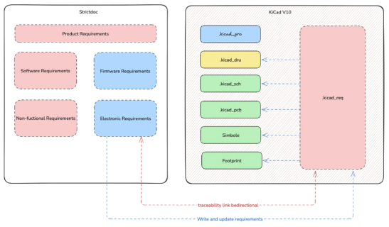

# 2026-07-14 StrictDoc Office Hours #63

## Participants

- Stanislav P.
- Steve L.
- Nicole P.
- Greg S.

## Topic 1

KiCad 

## Topic 2

2. Discuss the next steps as we are deciding which tickets should go into
   development. Discuss the feedback that we received on this topic:
   [https://github.com/strictdoc-project/strictdoc/discussions/3039](https://github.com/strictdoc-project/strictdoc/discussions/3039).

## Topic 3

1. Release
   [https://github.com/strictdoc-project/strictdoc/releases/tag/0.27.0](https://github.com/strictdoc-project/strictdoc/releases/tag/0.27.0).
   Including the email that was sent earlier: Upcoming changes to Python API:
   New Format and Feature abstractions.
